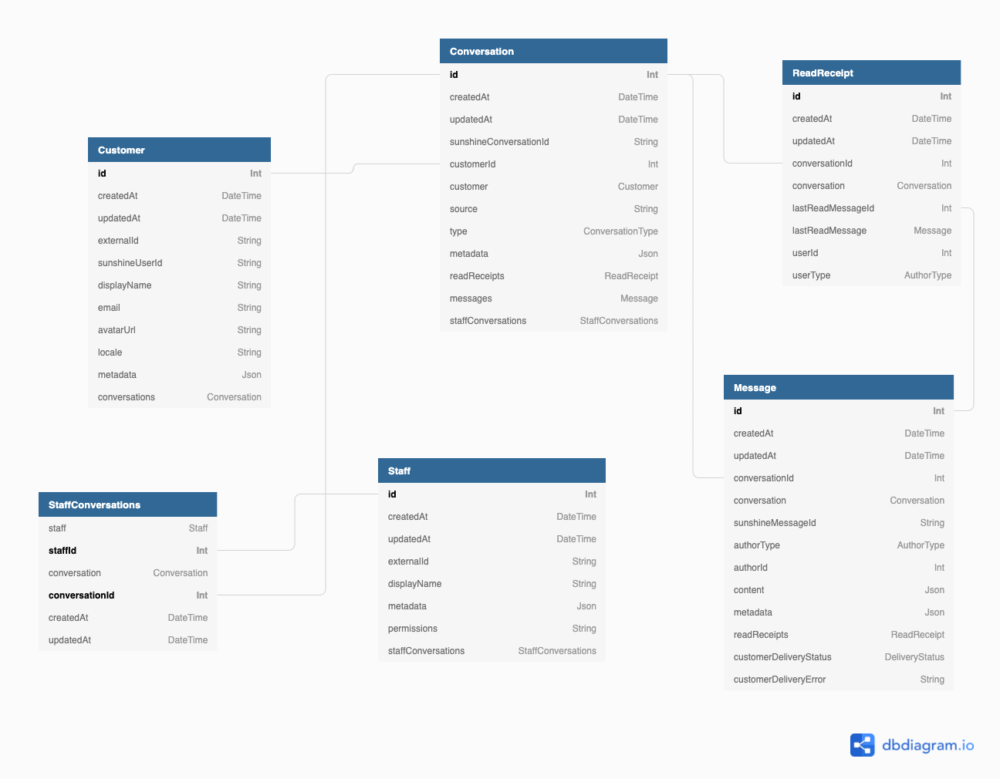

# Goodchat API

[](https://forthebadge.com)
[](https://forthebadge.com)

GoodChat API is a standalone [node.js](https://nodejs.org) web service allowing easy integration with [smooch.io](https://smooch.io)

<!-- START doctoc generated TOC please keep comment here to allow auto update -->
<!-- DON'T EDIT THIS SECTION, INSTEAD RE-RUN doctoc TO UPDATE -->

  - [Design notes](#design-notes)
    - [Features](#features)
- [Documentation](#documentation)
- [Prerequisites](#prerequisites)
  - [Dependencies](#dependencies)
  - [Sunshine Conversations](#sunshine-conversations)
    - [Credentials](#credentials)
    - [Terminology](#terminology)
    - [Guides](#guides)
    - [Steps](#steps)
- [Running the server](#running-the-server)
  - [Manually](#manually)
  - [On top of an existing Koa app](#on-top-of-an-existing-koa-app)
  - [Using the ready-made CLI script](#using-the-ready-made-cli-script)
  - [Running in development mode (with autoreload)](#running-in-development-mode-with-autoreload)
    - [Ngrok](#ngrok)
- [CLI Configuration](#cli-configuration)
  - [Environment variables](#environment-variables)
- [Testing](#testing)
- [Database](#database)
  - [Migrations](#migrations)
- [License](#license)

<!-- END doctoc generated TOC please keep comment here to allow auto update -->

### Design notes

The main purpose of Goodchat's is to integrate multiple chat channels to the [GoodCity Project](https://goodcity.hk), allowing people to donate goods directly via their existing channels.

That said, GoodChat was designed as a generic and reusable product and therefore holds _no_ shared business logic with the GoodCity. We intend this project, and therefore the code to be:

- Generic
- Reusable
- Configurable

#### Features

- [x] Integration with Sunshine Conversations
- [x] Webhooks support
- [ ] Live subscriptions support (notifications, new messages)
- [ ] Configuratbe Push Notification support	
- [ ] REST/GQL Chat API 
- [x] Configurable authentication methods (allowing easy integration with existing systems)


## Documentation

The code-generated documentation can be accessed [here](https://crossroads.github.io/api.goodchat/)

You can re-generate the documentation using the following npm script:

```bash
$> npm run document
```

Updating the README table of contents:

```bash
$> npm run doctoc
```

## Prerequisites

### System requirements

- Node 14.x
- NPM 7+

NPM 7 or above is required in order to handle peer-dependencies of the apollo server. An older version of NPM can be used but it may require you to install some modules manually

### Dependencies

Install the node dependencies using

```bash
$> npm install
```
### Sunshine Conversations

#### Credentials

Running GoodChat requires the following Sunshine Conversation credentials:

- An APP ID - Identifying which Sunshine app this is
- A Key ID - Acts as a username when authenticating to Sunshine
- A Key Secret - Acts as a password when authenticating to Sunshine

#### Terminology

- Smooch: The omnichat api used was previously known as Smooch, you may see that name in some places as it hasn't been fully renamed to "Sunshine Conversations" yet
- An integration: A chat service which connects to and integrates with Sunshine. e.g Whatsapp, Messenger, ...
- A custom integration: A chat service of our own which connects and integrates with Sunshine. GoodChat is a custom integration (it will auto-register itself)

#### Guides

<details>
	<summary>How to create a Sunshine Application</summary>
  
##### Steps
1. Login to your Sunshine Conversations account
2. Head to your dashboard (https://app.smooch.io)
3. On the right side click on the `Create new app` button
</details>

<details>
	<summary>How to create a Sunshine ID/Secret Key pair</summary>

#### Steps
1. Once your app is created, click on it from your dashboard view
2. On the app header bar, click on `Settings`
3. At the bottom of the settings page, you will find your api keys. Use the `Create new API key` action for a new one
4. Write down the ID/Secret key pair, as well as the APP ID
</details>

## Running the server
### Manually

You may create an instance of GoodChat, and start it manually as shown below

```typescript
import goodchat, { GoodChatAuthMode } from '@goodcity/api.goodchat'

const [app] = await goodchat({
  smoochAppId:            'sample_app_id',
  smoochApiKeyId:         'sample_api_key_id',
  smoochApiKeySecret:     'sample_api_key_secret',
  goodchatHost:           'localhost:8000',
  auth: {
    mode: GoodChatAuthMode.NONE
  }
})

app.listen(8000, () => {
  console.info('Goodchat is running');
})
```

### Using the ready-made CLI script

An pre-written startup script exists under the `/bin` folder to run the server. It can be used easily thanks to the following npm scripts: 

Build the project

```bash
$> npm run build
```

Run it

```bash
$> npm run start
```
### Running in development mode (with autoreload)

```bash
$> npm run dev
```

#### Ngrok

When running the server in a development environment (NODE_ENV=development), the startup script will initiate an [ngrok](https://www.npmjs.com/package/ngrok) tunnel in order to have callable webhooks.

## CLI Configuration

### Environment variables

When running the server from an NPM script, the server can be configured using the following environment variables

* `NODE_ENV`  - defines the environment it's running on. Options:
	* `production` 
	* `staging`
  * `development` (default)
* `NO_AUTH` - if set to "true" or "yes", will no support any form of authentication (good for testing)

## GraphQL

### Using the playground

- Open [](http://localhost:8000/graphql) on your browser to view the playground
- Make sure the Auth API is running, the default DEV environment will use localhost:3000 as an auth endpoint
- At the bottom of the playground, set the HTTP Headers to include an Authorization header
- Write your queries
- Press play

Here's an example query to get you started

```gql
query Conversations {
  conversations {
    id
    type
    messages {
      id
      content
    }
  }
}
```

## Testing

Goodchat specs are written using [Mocha](https://www.npmjs.com/package/mocha), they are all located under the `spec/` folder.

Run the specs using the following command:

```bash
$> npm run test
```

## Database

### Migrations

Please refer to the [Pristma Migrate Flow](https://www.prisma.io/docs/concepts/components/prisma-migrate/prisma-migrate-flows)

A set of npm scripts are available for the common actions:

- `db:migrate:new` Creates a new migration (without applying it)
- `db:migrate:dev` Applies migrations to the dev environment
- `db:migrate:prod` Applies migrations on production (to be used in CD)

## Authentication Modes

### None

This mode is present for development/testing purposes

### Webhook


### Diagram



## License

Copyright © 2020 by [Crossroads Foundation Ltd](https://www.crossroads.org.hk)

All rights reserved. No part of this software may be reproduced, distributed, or transmitted in any form or by any means, including photocopying, recording, or other electronic or mechanical methods, without the prior written permission of Crossroads Foundation Ltd. For permission requests, write to Crossroads Foundation Ltd., addressed “Attention: CTO” using the general contact details found on [www.crossroads.org.hk](https://www.crossroads.org.hk).
